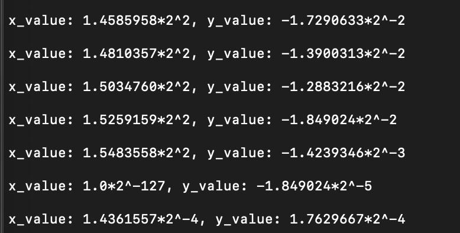

The STM32F769I is a microcontroller development board with a powerful Arm Cortex-M7 processor core. By default STM32F746G port existing in Tensorflow 2.0.0 build. In this tutorial, I would like to explain how to port and build Hello World example to the STM32F769I using Arm’s Mbed OS

Before begin, I strongly recommend O'Reilly TinyML book from the authors Pete Warden & Daniel Situnayake.
https://tinymlbook.com/.
I will skip some basic steps which are mentioned in the book at chapter 4-5-6

I assume you already downloaded mbed-cli and tensorflow to your local machine.

If you have any question or comment, feel free to e-mail me. erhankurubas@gmail.com  

## STEP 1
## Create template for STM32F769I
Change into directory to

    tensorflow/tensorflow/lite/micro/tools/make/templates

Copy _BSP_DISCO_F769NI.lib.tpl_ and _LCD_DISCO_F769NI.lib.tpl_ files into the templates

This template files nothing but only link to deploy dependencies which I will explain in STEP 4
## STEP 2
## Add disco_f769ni to examples folder

Change into directory:

    tensorflow/tensorflow/lite/micro/examples

Copy disco_f769ni folder under hello_world directory
## STEP 3
## Generate a directory suitable for mbed
To do so, run the following command in the bash inside tensorflow root directory.

    make -f tensorflow/lite/micro/tools/make/Makefile TARGET=mbed TAGS="CMSIS disco_f769ni" generate_hello_world_mbed_project

As a result below directory will be created.  

    tensorflow/lite/micro/tools/make/gen/mbed_cortex-m4/prj/hello_world/mbed

This directory contains all of the example’s dependencies structured in the correct way for Mbed to be able to build it  
## STEP 4
## Download the dependencies
First, change into the directory so that you can run some commands in there from mbed-cli  

    cd tensorflow/lite/micro/tools/make/gen/mbed_cortex-m4/prj/hello_world/mbed

To get started, use the following command to specify to Mbed that the current directory is the root of an Mbed project:

    mbed config root .

Next, instruct Mbed to download the dependencies and prepare to build:

    mbed deploy
## FINAL STEP
## Compile && flash

run the following command

    mbed compile --target DISCO_F769NI --toolchain GCC_ARM --flash --sterm

This command will allow you to compile, load and open serial port of mbed-cli to see printf outputs

Important note : I did some fix to avoid hard fault while drawing circle at the negatif y_pos

Also I included led and button just for fun. I can not imagine embedded hello world project without led and button :)

So don't be suprise when you see different output_handler.cc from the original one.

__Congratulations! You have deployed the application__

Keep in mind; to make some changes in the code you should edit the c or cc files into the mbed folder. Do not except any change if you edit tensorflow/tensorflow/lite/micro/examples/hello_world/disco_f769ni files.
